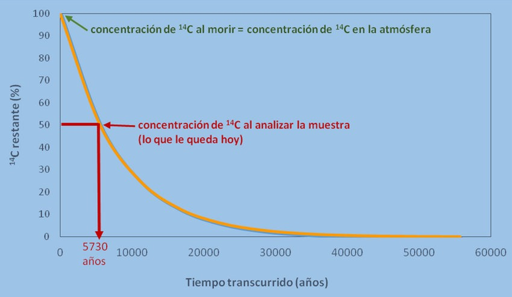

## Integrantes

1. Espinoza Huaman, Diego Alexhander
1. Tanaka Matheus, Louiggi
1. Linares Rojas, Ander Rafael
1. Vilchez Quispe, Yoshiro Cardich
1. Solimano Cure, Franco David
1. Porras Anco, Sebastian Aaron
1. Madrid Llanos, Karla Patricia

# Marco Teórico

::: columns

:::: {.column width=70%}

- La [**cinética química**]{.underline} estudia la velocidad a la cual ocurren las reacciones químicas y los factores que influyen en esta velocidad.
- Las [**reacciones químicas**]{.underline} es un proceso en el cual una o más sustancias, denominadas reactivos, se transforman en una o más sustancias diferentes, denominadas productos
- Dos tipos de reacciones: 
  - **Reacciones de Primer Orden:** la velocidad que depende linealmente de la concentración de un reactivo.
    - $X(t)$ es la concentración de la sustancia $A$ en el tiempo $t$.
    - $k$ es la constante de velocidad de reacción (con $k>0$).
  - **Reacciones de Segundo Orden:** la velocidad de reacción depende del producto de las concentraciones de dos reactivos.
    - $\alpha, \beta$: cantidades de los químicos $A$ y $B$ $(t=0)$
    - $X(t)$: la cantidad de sustancia en el tiempo $t$.
    - $k$: constante de proporcionalidad

::::

:::: {.column width=30%}

$~$

$~$

$$\frac{dX}{dt} = -kX$$

$~$

$$\ce{A + B -> C}$$

$$\frac{dX}{dt} = k(\alpha - X)(\beta - X)$$

::::

:::

---

- [**Aplicaciones**]{.underline}

  - **Decaimiento radiactivo:** La desintegración de isótopos radiactivos sigue una cinética de primer orden.
  - **Reacciones enzimáticas:** Algunas reacciones catalizadas por enzimas pueden aproximarse por cinéticas de segundo orden.
  - **Farmacocinética:** La absorción y eliminación de fármacos del cuerpo a menudo se modelan utilizando cinéticas de primer o segundo orden, dependiendo de la naturaleza del proceso.

$~$

::: columns

:::: column

{height=35%}

::::

:::: column

{height=35%}

::::

:::

# Ejemplos

## Ejemplo 1

### Enunciado

Un compuesto $C$ se forma cuando se combinan dos sustancias químicas $A$ y $B$. La relación resultante entre las dos sustancias químicas es tal que por cada gramo de $A$ se utilizan $4 g$ de $B$. Se observa que se forman $30 g$ del compuesto $C$ en 10 minutos. Determine la cantidad de $C$ en el tiempo $t$ si la velocidad de la reacción es proporcional a las cantidades restantes de $A$ y $B$, si inicialmente hay $50 g$ de $A$ y $32 g$ de $B$. ¿Qué cantidad del compuesto $C$ hay a los 15 minutos

### Desarrollo

::: columns

:::: column

$$\begin{split}
\ce{A + B & -> C} \\
A + B = C & \text{, pero} \quad 4A = B \\
A = \frac{C}{5} & \rightarrow{} B = \frac{4C}{5} \\
\frac{dC}{dt} = k(50 - & A)(32 - B) \\
\end{split}$$

::::

:::: column

$$\begin{split}
\frac{dC}{dt} & = k\left(50 - \frac{C}{5}\right) \left(32 - \frac{4C}{5}\right) \\
\frac{dC}{dt} & = k(250 - C)(40 - C) \\
\end{split}$$

::::

:::

## Ejemplo 5

### Enunciado
En la reacción de tercer orden o trimolecular $\ce{A + B + C -> M + N}$, $a$, $b$ y $c$ moles por litro de $A$, $B$ y $C$ se combinan. Si $x$ denota el número de moles por litro de $A$, $B$ o $C$ que han reaccionado después de un tiempo $t$ (0 el número de moles por litro de $M$ o $N$ que se han formado), entonces la tasa de la reacción está dada por:

$$\dfrac{dx}{dt}=k(a-x)(b-x)(c-x)$$

Si a, b y c son diferentes y x(0)=0, resolver la EDO

---

### Desarrollo

$$\begin{split}
\dfrac{dx}{(a-x)(b-x)(c-x)} = k dt \\
\end{split}$$

# Gracias por su atención

```{=latex}
\begin{center}
```

{width=60%}

```{=latex}
\end{center}
```